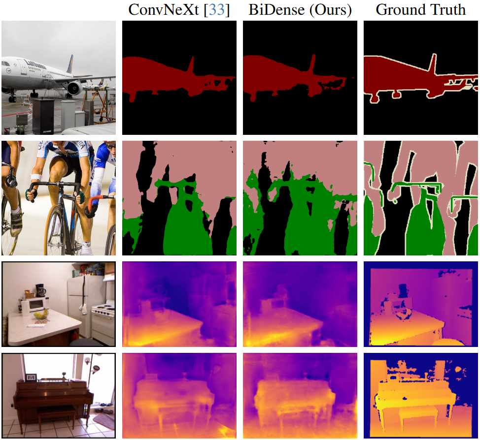

# BiDense: Binarization for Dense Prediction
  
**BiDense**, a generalized **Bi**narization framework designed for efficient and accurate **Dense** prediction tasks. 

<div align="center">

</div>

## Abstract
Dense prediction is a critical task in computer vision. 
However, previous methods often require extensive computational resources, which hinders their real-world application. 
In this paper, we propose BiDense, a generalized binary neural network (BNN) designed for efficient and accurate dense prediction tasks. 
BiDense incorporates two key techniques: the Distribution-adaptive Binarizer (DAB) and the Channel-adaptive Full-precision Bypass (CFB).
The DAB adaptively calculates thresholds and scaling factors for binarization, effectively retaining more information within BNNs. 
Meanwhile, the CFB facilitates full-precision bypassing for binary convolutional layers undergoing various channel size transformations, which enhances the propagation of real-valued signals and minimizes information loss.
By leveraging these techniques, BiDense preserves more real-valued information, enabling more accurate and detailed dense predictions in BNNs. 
Extensive experiments demonstrate that our framework achieves performance levels comparable to full-precision models while significantly reducing memory usage and computational costs.

## Dependencies
- `torch`: tested on v2.1.2+cu118
- `lightning`: tested on v2.1.3
- `yacs`: tested on v0.1.8

## Data Preparation
Use the scripts from [DANet](https://github.com/junfu1115/DANet) to prepare the semantic segmentation datasets:
- [ADE20K](https://github.com/junfu1115/DANet/blob/master/scripts/prepare_ade20k.py)
- [PASCAL VOC 2012](https://github.com/junfu1115/DANet/blob/master/scripts/prepare_pascal.py)

Use the scripts from [BTS](https://github.com/cleinc/bts) to prepare the monocular depth estimation datasets:
- [NYUv2 & KITTI](https://github.com/cleinc/bts/tree/master/pytorch#nyu-depvh-v2)

All datasets should be placed in a `dataset` folder in the same directory as `BiDense`:
```
|-- BiDense
|   |-- assets
|   |-- binary
|   ...
|-- dataset
    |-- ADEChallengeData2016
    |-- nyu_depth_v2
    ...
```

## Training and Evaluation
Training:
```shell
python train_segmentation.py configs/segmentation/{model}_{bnn}_{dataset}.yaml
python train_depth.py configs/depth/{model}_{bnn}_{dataset}.yaml

# e.g.
python train_segmentation.py configs/segmentation/dpt_bidense_ade20k.yaml
python train_depth.py configs/depth/upernet_bidense_nyu.yaml --gpus 0,1
```
The project uses `lightning` to automatically save the checkpoint files `.ckpt`. Use `--gpus` to select the GPUs you want to use, e.g., `--gpus 0,1,2,3`.

Evaluation:
```shell
python test_segmentation.py configs/segmentation/{model}_{bnn}_{dataset}.yaml {path to .ckpt}
```

## Acknowledgements
In this repository, we have used code from the following repositories. We thank all the authors for sharing their excellent work:
- [DPT](https://github.com/isl-org/DPT)
- [BTS](https://github.com/cleinc/bts)
- [DANet](https://github.com/junfu1115/DANet)
- [BiBench](https://github.com/htqin/BiBench)
- [BiViT](https://github.com/ThisisBillhe/BiViT)
- [ReActNet](https://github.com/liuzechun/ReActNet)
- [Depth Anything](https://github.com/LiheYoung/Depth-Anything)
- etc.


## Citation
```
@article{yin2024bidense,
  title={BiDense: Binarization for Dense Prediction},
  author={Yin, Rui and Qin, Haotong and Zhang, Yulun and Li, Wenbo and Guo, Yong and Zhu, Jianjun and Wang, Cheng and Jia, Biao},
  journal={arXiv preprint arXiv:2411.10346},
  year={2024},
}
```
